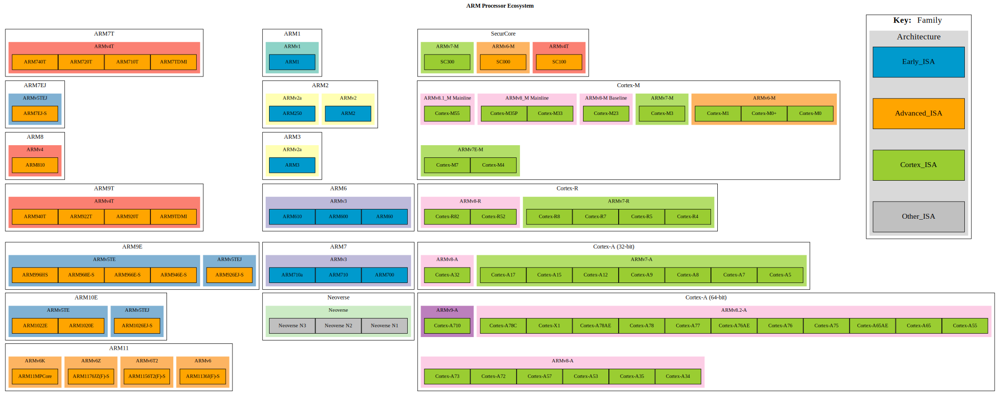

# Arm Processor Ecosystem
Infographic of ARM microarchitectures as tabulated on Wikepedia's [List_of_ARM_microarchitectures](https://en.wikipedia.org/wiki/List_of_ARM_microarchitectures)

## Terms
- Family
- Architecture
- Early_ISA
- Advanced_ISA
- Cortex_ISA
- Other_ISA

# The infographic

